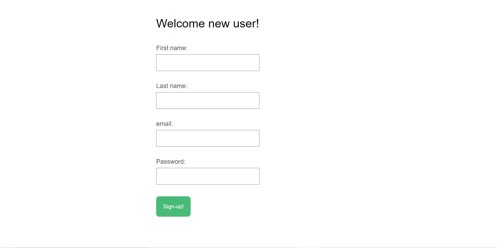
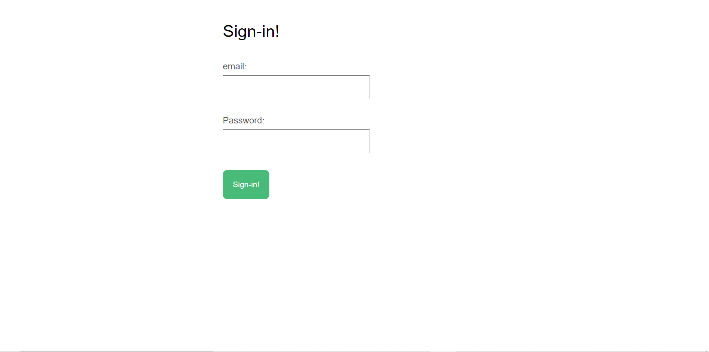
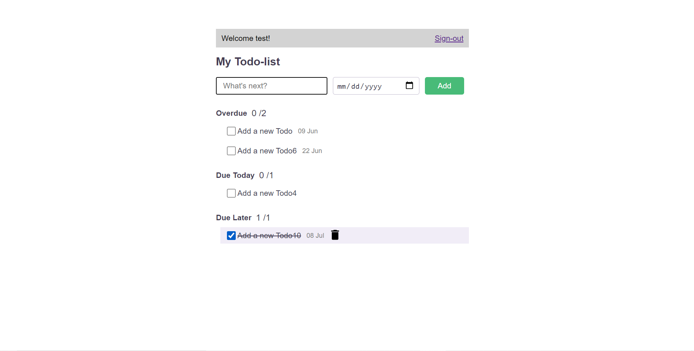

# [Todo Manager](https://ajith-todo-manager-saas-201.herokuapp.com)

 This app is built to store user's todos-list by date and a user can view or mark completed or not completed in their own todos.

 ## Home page

 - Before enter todopage, user must be [sign-in](https://ajith-todo-manager-saas-201.herokuapp.com/signin) the page.
 - If you are new user, [sign-up](https://ajith-todo-manager-saas-201.herokuapp.com/users/new) and use.

## Sign-up page

## Sign-in page

## Todos page

 - The todo-list divide by a period. past(Over due), present(Due today), Future(Due later)
